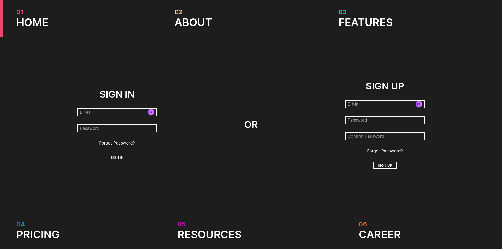

# NostalGlow
A website for a business that takes people's memories (consensually) and stores them in state-of-the-art capsules
**This is just for a Project; the company doesn't exist (yet)**

## How to run
### Using docker
Ensure docker and docker-compose are installed then inside this directory run:
```
docker-compose up --build
```

# Screenshots
### Homepage

### About

### Features

### Pricing

### Resources

### Account

