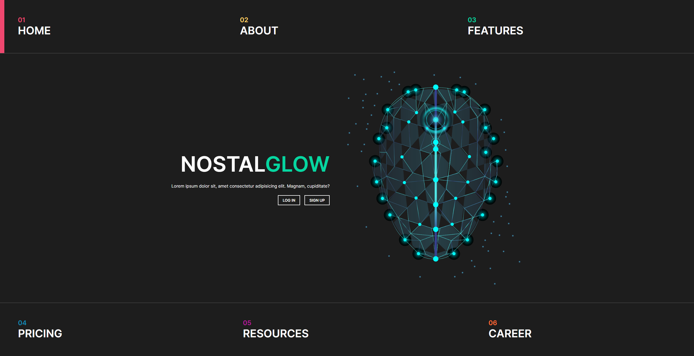
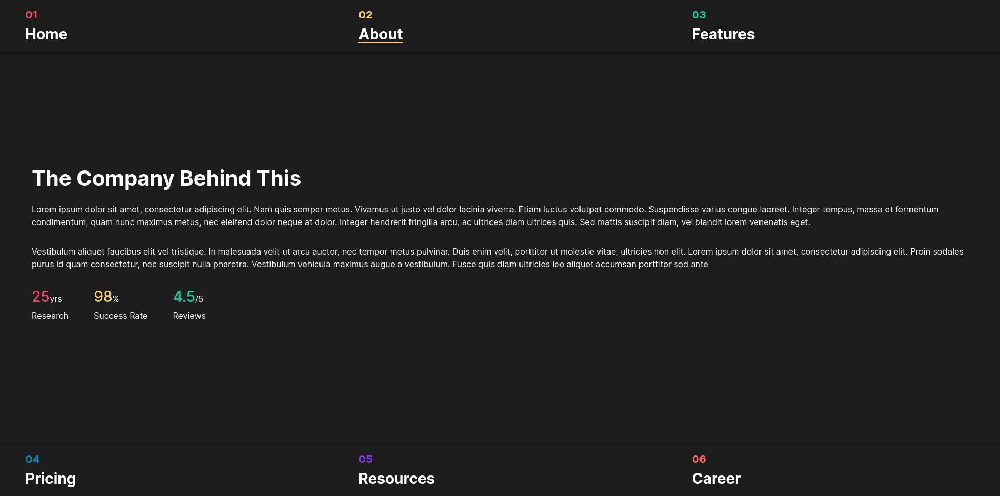
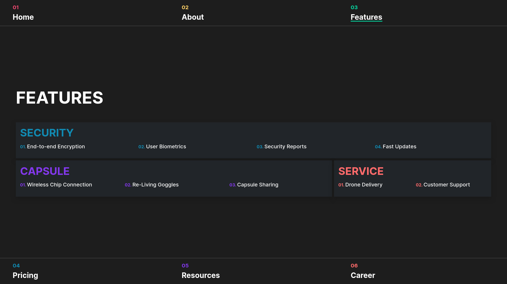
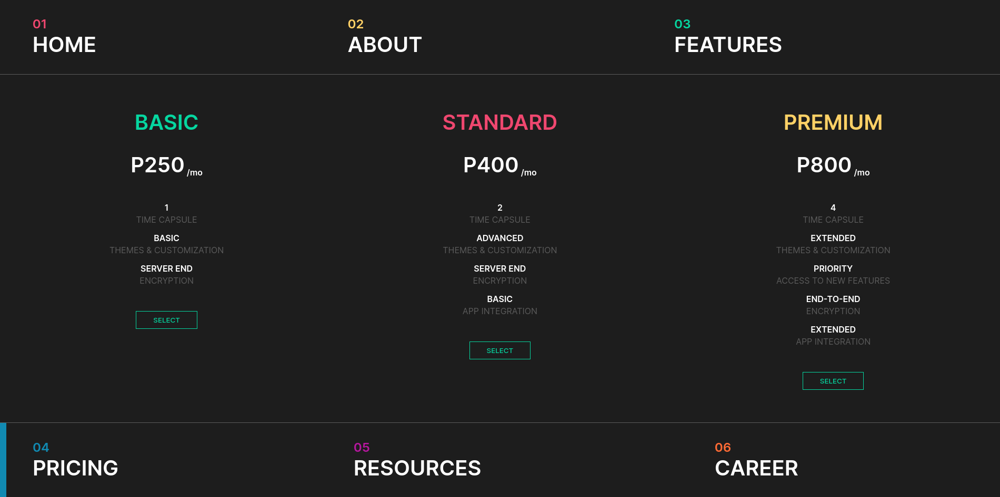
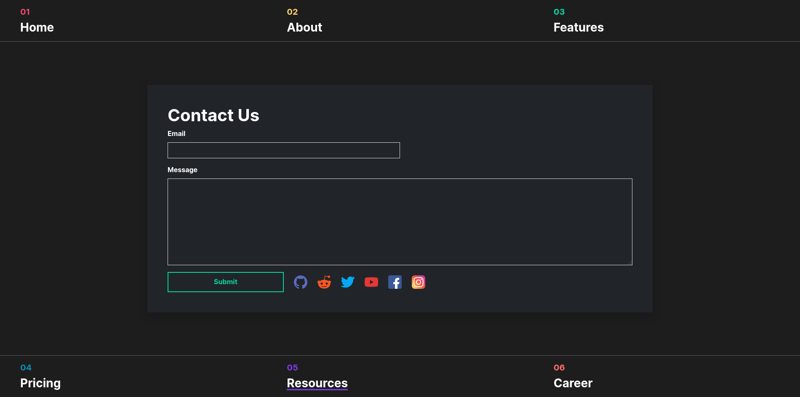
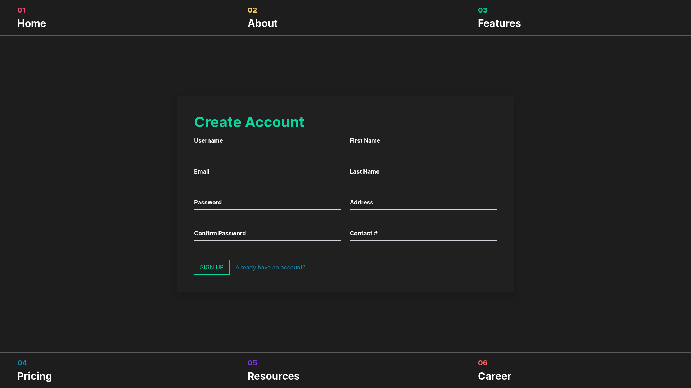

# NostalGlow
A website for a business that takes people's memories (consensually) and stores them in state-of-the-art capsules
**This is just for a Project; the company doesn't exist (yet)**

## How to run
> [!TIP]
> If possible use docker and docker-compose
### Using docker
Ensure docker and docker-compose are installed then inside this directory run:
```shell
docker-compose up --build
```
### Using XAMPP
Go inside the htdocs folder of this repo, copy the NostalGlow folder from there to your xampp/htdocs.
```powershell
copy-item -path ".\htdocs\NostalGlow" -destination "C:\xampp\htdocs" -recursive
```

## Screenshots
### Homepage

### About

### Features

### Pricing

### Resources

### Sign Up


# Todo
- [x] Sign In page
- [x] Resources Page
- [x] Fix pricing page
- [x] career page
- [x] Database log table
- [x] user dashboard
- [x] admin dashboard
- [x] user dashboard memories features
- [x] homepage for logged in users
- [x] user subscription
