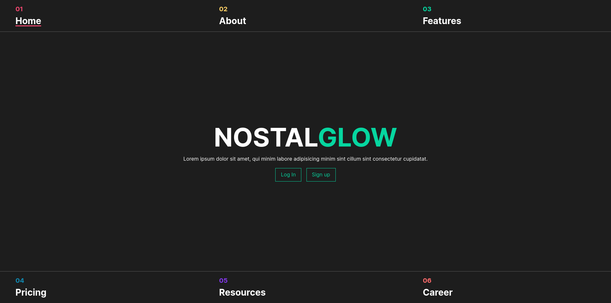

# NostalGlow
A website for a business that takes people's memories (consensually) and stores them in state-of-the-art capsules
**This is just for a Project; the company doesn't exist (yet)**

## How to run
> [!TIP]
> If possible use docker and docker-compose 
### Using docker
Ensure docker and docker-compose are installed then inside this directory run:
```shell
docker-compose up --build
```
### Using XAMPP
Copy and paste the entire directory to the htdocs folder inside your xampp directory

# Screenshots
### Homepage

### About

